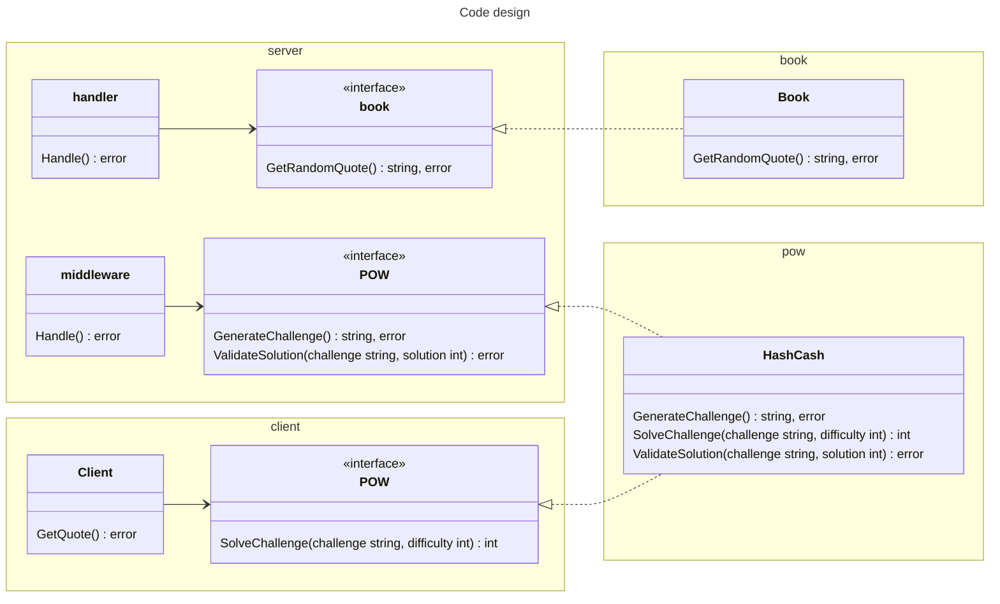
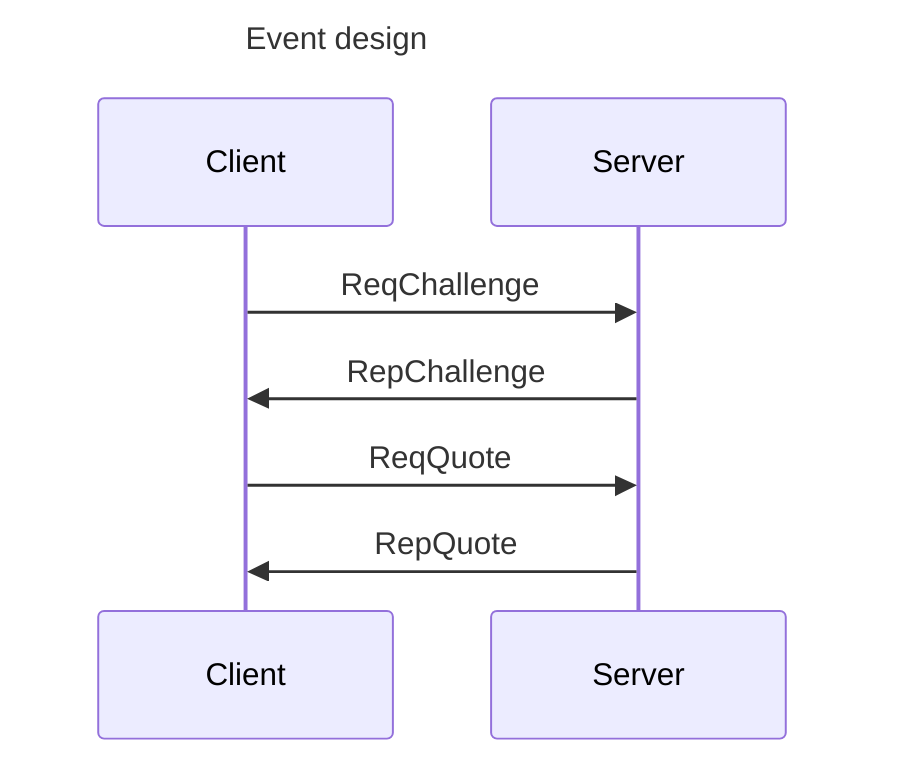

# faraway-test

[](https://codecov.io/gh/itimky/faraway-test)
[](https://goreportcard.com/report/github.com/itimky/faraway-test)


## Test task for Server Engineer

```text
Design and implement “Word of Wisdom” tcp server.
 • TCP server should be protected from DDOS attacks with the
   Proof of Work (https://en.wikipedia.org/wiki/Proof_of_work),
   the challenge-response protocol should be used.
 • The choice of the POW algorithm should be explained.
 • After Proof Of Work verification, server should send one of
   the quotes from “word of wisdom” book or any other collection
   of the quotes.
 • Docker file should be provided both for the server and for
   the client that solves the POW challenge
```

Chosen POW algorithm: [HashCash](https://en.wikipedia.org/wiki/Hashcash) as it is simple enough for a test.

<!-- https://mermaid.js.org/syntax/classDiagram.html -->




